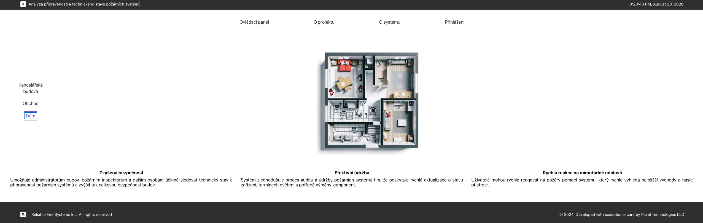

# Fire Systems Readiness Analyzer

A React-based web application developed as a diploma project for assessing the readiness and technical condition of fire-safety systems. The application provides an interface for working with fire-system information, creating and editing building schemes, and supporting safety-management workflows.

## Application preview



## Features

- User-friendly web interface for working with fire-safety system data
- Creation and editing of building layouts and fire-system schemes
- Supporting pages and workflows required for system operation
- A foundation for assessing the readiness and technical condition of fire-safety systems
- A structured solution designed to improve safety management and support timely response to fire-safety incidents

## Technology stack

- React
- JavaScript
- HTML5
- CSS3

## Prerequisites

To run the project locally, install:

- Node.js
- npm

## Installation and launch

1. Clone the repository:

   ```bash
   git clone git@github.com:Petya-Vasechkin/Web-app-for-fire-systems.git
   ```

2. Open the project folder:

   ```bash
   cd Web-app-for-fire-systems
   ```

3. Install dependencies:

   ```bash
   npm install
   ```

   This command downloads all packages specified in `package.json` and creates the local `node_modules` directory.

4. Start the development server:

   ```bash
   npm start
   ```

5. Open the application in a browser:

   ```text
   http://localhost:3000
   ```

## Compatibility note

This project uses a legacy Create React App / Webpack configuration. If `npm start` fails with `ERR_OSSL_EVP_UNSUPPORTED` on newer Node.js versions, run:

```bash
NODE_OPTIONS=--openssl-legacy-provider npm start
```

## Author

Pavel Metelev